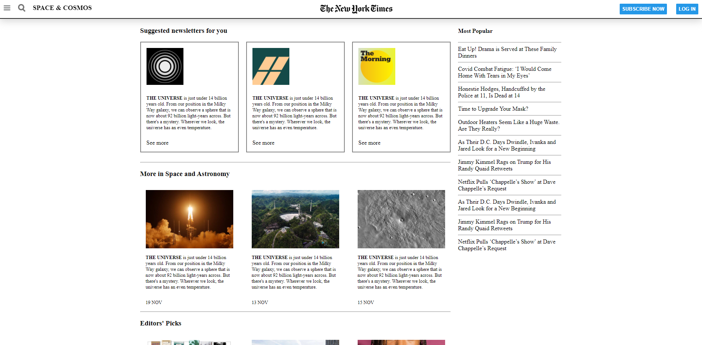
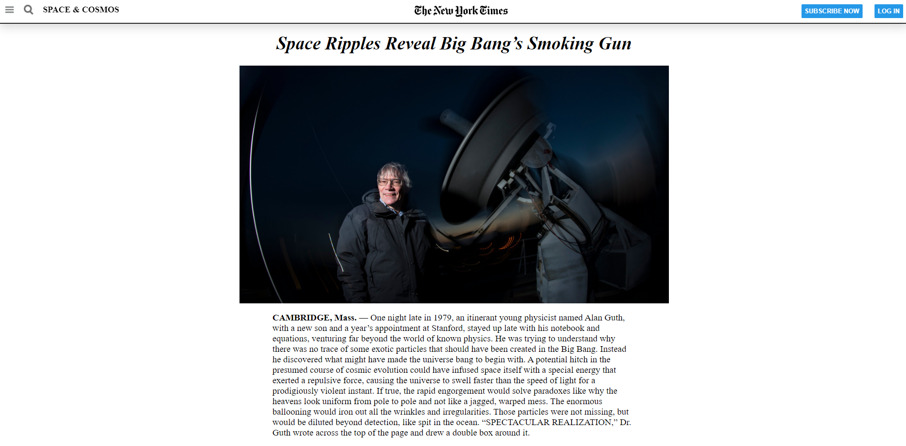

# NewYorkTimesProject-1

> First Project cloning NYtimes article webpage.

Additional description about the project and its features.

## Built With

- HTML
- CSS

## Live Demo

[Live Demo Link](https://mohamed-js.github.io/MV-Project1/)

## Authors

👤 **Mohammed Atef**

- GitHub: [@MohammedAtef](https://github.com/Mohamed-js)

👤 **Charles Eneh**

- GitHub: [@Charles](https://github.com/charlyeneh)

## 🤝 Contributing

Contributions, issues, and feature requests are welcome!

## Show your support

Give a ⭐️ if you like this project!

## Acknowledgments

- Hat tip to anyone whose code was used
- Inspiration
- etc

